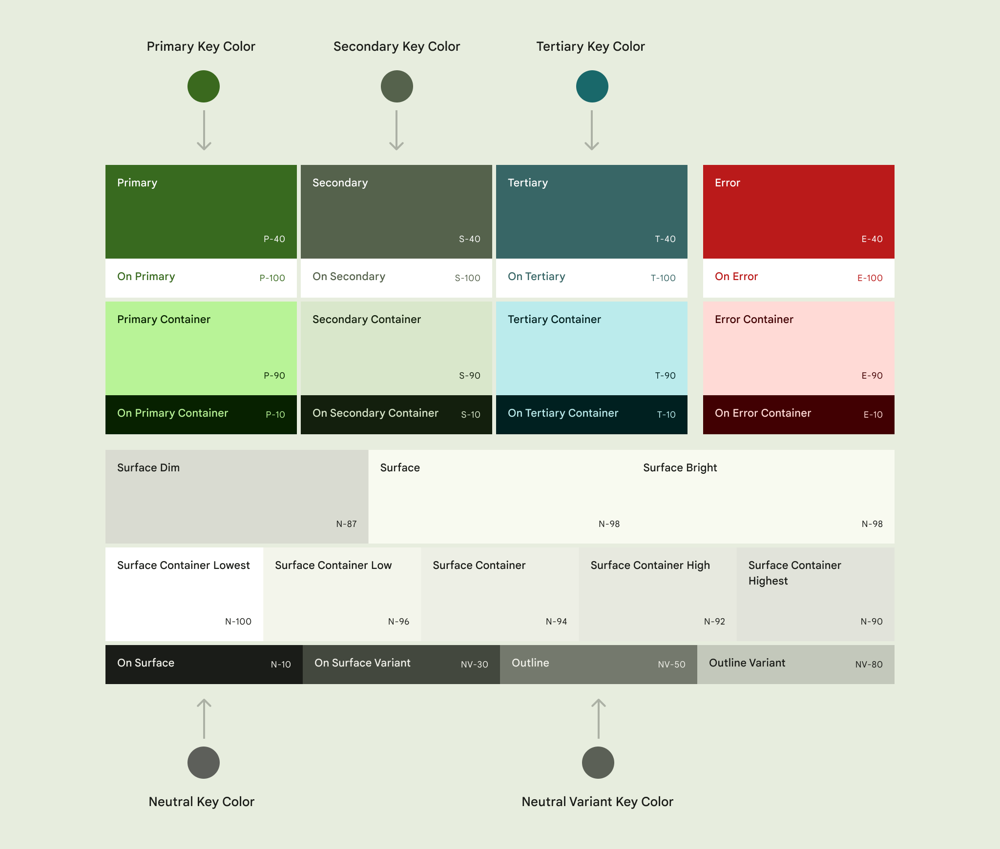
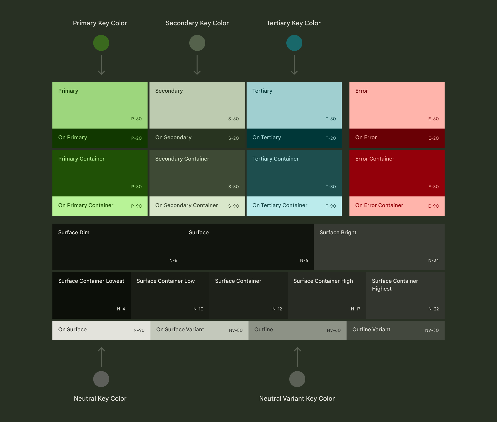

# Color

<!--*
# Document freshness: For more information, see go/fresh-source.
freshness: { owner: 'lizmitchell' reviewed: '2023-09-06' }
tag: 'docType:howTo'
*-->

<!-- go/mwc-color -->

<!-- [TOC] -->

[Color](https://m3.material.io/styles/color/overview)<!-- {.external} --> creates meaning
and communicates hierarchy, state, and brand.

## Color scheme

<!-- go/md-sys-color -->

A
[color scheme](https://m3.material.io/styles/color/the-color-system/color-roles#55d2b7d2-0202-4616-887e-f575a7946aac)<!-- {.external} -->
is the group of
[key color tones](https://m3.material.io/styles/color/the-color-system/key-colors-tones#5fdf196d-1e21-4d03-ae63-e802d61ad5ee)<!-- {.external} -->
assigned to specific roles that get mapped to components.





> Tip: use the
> [Material theme builder Figma plugin](https://www.figma.com/community/plugin/1034969338659738588/Material-Theme-Builder)<!-- {.external} -->
> to generate a color scheme.
>
> Alternatively, use the
> [`material-color-utilities` library](https://www.npmjs.com/package/@material/material-color-utilities)<!-- {.external} -->
> to generate color schemes at runtime.

### Tokens

A color scheme can be set using
[CSS custom properties](https://developer.mozilla.org/en-US/docs/Web/CSS/--*)<!-- {.external} -->.
Tokens follow the naming convention `--md-sys-color-<token>`.

All tokens have a corresponding `--md-sys-color-on-<token>` for content color
with accessible contrast.

Key color | Tokens
--------- | --------------------------------------------
Primary   | `--md-sys-color-primary`
&nbsp;    | `--md-sys-color-primary-container`
Secondary | `--md-sys-color-secondary`
&nbsp;    | `--md-sys-color-secondary-container`
Tertiary  | `--md-sys-color-tertiary`
&nbsp;    | `--md-sys-color-tertiary-container`
Error     | `--md-sys-color-error`
&nbsp;    | `--md-sys-color-error-container`
Neutral   | `--md-sys-color-background`
&nbsp;    | `--md-sys-color-surface`
&nbsp;    | `--md-sys-color-surface-bright` *
&nbsp;    | `--md-sys-color-surface-dim` *
&nbsp;    | `--md-sys-color-surface-container` *
&nbsp;    | `--md-sys-color-surface-container-lowest` *
&nbsp;    | `--md-sys-color-surface-container-low` *
&nbsp;    | `--md-sys-color-surface-container-high` *
&nbsp;    | `--md-sys-color-surface-container-highest` *
&nbsp;    | `--md-sys-color-outline`
&nbsp;    | `--md-sys-color-outline-variant`

*\* all surface tokens use `--md-sys-on-surface` or
`--md-sys-color-on-surface-variant` for their content.*

*   [All tokens](https://github.com/material-components/material-web/blob/main/tokens/_md-sys-color.scss)
    <!-- {.external} -->

```css
:root {
  --md-sys-color-primary: #006A6A;
  --md-sys-color-on-primary: #FFFFFF;
  --md-sys-color-primary-container: #6FF7F6;
  --md-sys-color-on-primary-container: #002020;
  /* ... */
}
```

<!--#include file="../../googlers/theming-color.md" -->
